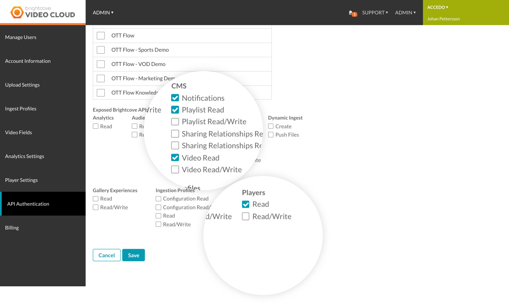

# zapp-pipes-provider-brightcove

A data source provider for the brightcove CMS API

### Playlist handler
The required parameters are `id`, `client_id`, `client_secret`, `account_id`

To setup a playlist feed in Zapp you need to provide: ?client_id=<your client id>&client_secret=<client_secret>&account_id=<account ID>&id=<the ID of the playlist you are trying to consume>

### Folder handler

The required parameters are `id`, `client_id`, `client_secret`, `account_id`

To setup a playlist feed in Zapp you need to provide: ?client_id=<your client id>&client_secret=<client_secret>&account_id=<account ID>&id=<the ID of the folder you are trying to consume>

### Search handler

TBC

### Getting your credentials

https://support.brightcove.com/oauth-get-client-credentials-using-curl
https://support.brightcove.com/api-operations-client-credentials-requests

### Setting up the brightcove account

Regarding Feeds setup, generally for consuming the APIs via DSPs, these credentials are required.

